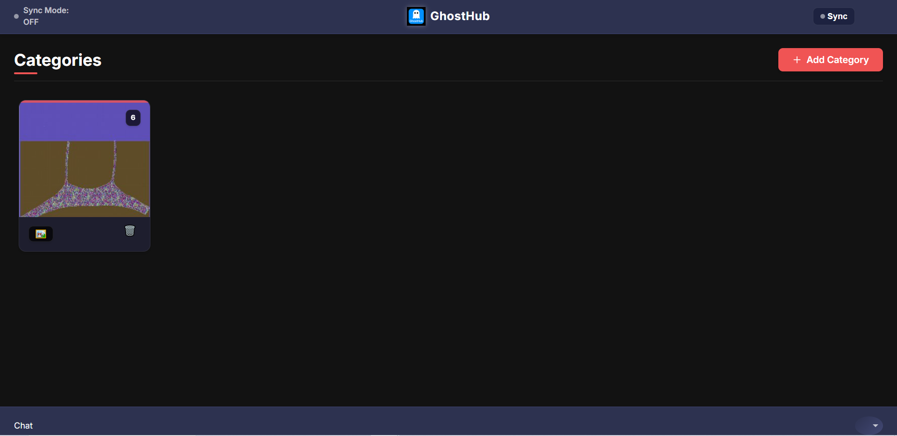

# 👻 GhostHub

<div align="center">
  
[](https://ghosthub.net)

[](https://github.com/BleedingXiko/GhostHub/releases)

[](https://github.com/BleedingXiko/ghosthub/blob/main/LICENSE)

[](https://github.com/BleedingXiko/ghosthub/stargazers)

[](#)
</div>

**GhostHub** is a zero-setup, mobile-first media server you can run instantly and share over the internet. No accounts. No config. Just swipe through your own folder like it's TikTok.

Perfect for temporary sharing, personal libraries, or lightweight deployments with friends.

Runs as a **Python script**, **one-click Windows `.exe`**, or **Docker container** — no install, no accounts, no cloud.

> **Legacy branch notice**
>
> This branch preserves the older public GhostHub codebase and remains available under the MIT License as it was originally released.
>
> The current GhostHub project has moved to a new AGPL-3.0 licensed source tree on `main`. New development, releases, documentation, and issue tracking should follow the current `main` branch unless you specifically need this historical MIT version.

> **v1.6:**
> - Saved session progress per category (even with shuffle)
> - Full **Pinggy** tunnel integration with live status and config UI  
> - Dynamic category thumbnails fixed across environments (incl. Docker)
> - New `/kick` command to remove users by session ID
> - Slash command popup with instant filtering and improved input handling
> - Chat and modal UI fully reworked for smoother mobile and desktop use

---

## 📱 Preview Gallery

### Desktop View (Use arrow keys to navigate inside categories)



<div style="text-align: center; display: flex; justify-content: center; gap: 20px;">
  
  
</div>

---

## 🚀 Features

-   📁 Add custom folders and browse your media

-   🎞️ TikTok-style swipe navigation for images & videos

-   🔁 Optional host sync — everyone sees the same media, watches at their own pace

-   🔐 Sync password protection + admin-only controls

-   🧑‍🤝‍🧑 Live user counter and join notifications

-   💬 Built-in real-time chat (ephemeral, anonymous)

-   ⌨️ Slash commands like /myview and /help

-   📱 Fully mobile and desktop optimized

-   🌐 Optional public sharing via Cloudflare Tunnel

-   🖥️ Portable `.exe` with no dependencies or setup

-   🐳 Docker support (including ARM64)

-   💾 External config (`media_categories.json`) for folder persistence


---

## ⚙️ How to Run GhostHub

### 🔧 Option 1: Standalone Executable (Windows)

The `.exe` contains everything — no setup needed.

1.  Run `GhostHub.exe`

2.  You’ll be prompted to enable a Cloudflare Tunnel

3.  URL is auto-copied to clipboard (if enabled)

4.  Open your browser to: [http://localhost:5000](http://localhost:5000/)


> 📁 `media_categories.json` is saved in the same folder
> ✅ No need to download cloudflared — it’s bundled

---

### 💻 Option 2: Python (Manual / Development Mode)

1.  Install **Python 3.7+**

2.  _(Optional)_ Place `cloudflared.exe` in project root

3.  Install dependencies:

    ```bash
    pip install -r requirements.txt
    ```

4.  Start the server:

    ```bash
    python ghosthub.py
    ```


> 💡 If `cloudflared.exe` is found, you’ll be prompted to start a tunnel

---

### 🐳 Option 3: Docker (Cross-Platform)

1.  Install Docker

2.  Pull the latest image:

    ```bash
    docker pull dhux/ghosthub:latest
    ```

3.  Create a `docker-compose.yml` with your media folders:

    ```yaml
    version: '3'
    services:
      ghosthub:
        image: dhux/ghosthub:latest
        container_name: ghosthub
        ports:
          - "5000:5000"
        volumes:
          - ../instance:/app/instance
          - ../media:/media
          # Windows paths (Docker Desktop):
          - C:/Users/username/Pictures:/media/pictures
          - C:/Users/username/Videos:/media/videos
          # Linux/macOS paths:
          # - /home/user/Pictures:/media/pictures
          # - /home/user/Videos:/media/videos
        environment:
          - PORT=5000
          - FLASK_CONFIG=production
          - DOCKER_ENV=true
    ```

4.  Start it up:

    ```bash
    docker-compose up
    ```

5.  Visit: [http://localhost:5000](http://localhost:5000/)


> 🧠 Tunnel management is now fully in the web UI
> 📂 Categories auto-generate for anything under `/media`

---

## 🛠️ Build the Executable

Use `bin/build_exe.bat`

```bash
bin/build_exe.bat
```

> Output is saved to `/dist/GhostHub.exe`

---

## 🗂 Media Categories

-   Click `Add Category`

-   Choose folder and name

-   Auto-saved to `media_categories.json`


---

## 📽 Supported Formats

**Images:** jpg, jpeg, png, gif, bmp, tiff, webp, heic, etc.
**Videos:** mp4, webm, mov, mkv, avi, ts, flv, etc.

---

## 🎬 GhostStream Integration

GhostStream enables hardware-accelerated transcoding for videos that browsers can't play natively (MKV, HEVC, AVI, etc.).

### Setup

1. Run [GhostStream](https://github.com/BleedingXiko/GhostStream) on a PC with GPU (NVIDIA/AMD)
2. In GhostHub Settings → GhostStream:
   - Enable GhostStream
   - Enter server URL (e.g., `192.168.1.100:8765`)
   - Click "Test Connection"

### Features

- **Auto-connect** - GhostHub connects to GhostStream automatically on startup
- **Live Transcoding** - MKV/HEVC videos stream via HLS in real-time
- **Batch Transcode** - Pre-transcode entire categories with "Transcode All" button
- **GPU Acceleration** - NVENC, AMF, QSV support for fast transcoding

---

## 👻 Final Notes

GhostHub is a lightweight ephemeral media server built for speed, fun, and control.

Start it up. Share a link. Watch with friends. No cloud, no login, no trace.

Ghost on. 👻
