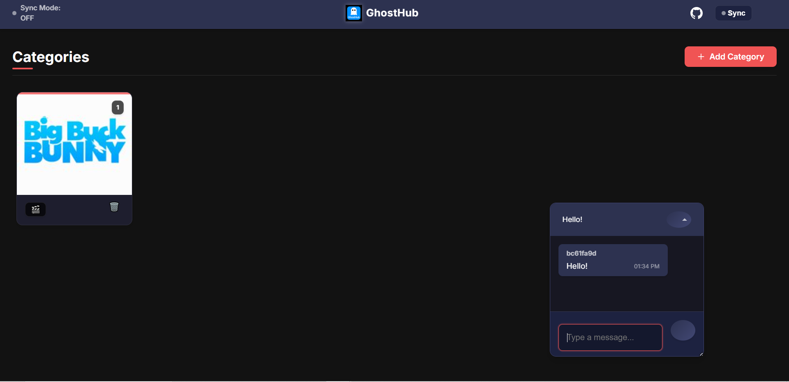

# 👻 GhostHub

[](https://ghosthub.net)

**GhostHub** is a zero-setup, mobile-first media server you can run instantly and share over the internet. No accounts. No config. Just swipe through your own folder like it's TikTok.

**⚠️ Warning:** Please review [Known Issues](#known-issues) regarding security before use.

Perfect for temporary sharing, personal libraries, or lightweight deployments with friends.

Runs as a **Python script**, **one-click Windows `.exe`**, or **Docker container** — no install, no accounts, no cloud.

## 📱 Preview Gallery

### Desktop View (Use arrow keys to navigate inside categories)


<div style="text-align: center; display: flex; justify-content: center; gap: 20px;">
  
  
</div>

---

## 🚀 Features

- 📁 Add custom folders and browse your media
- 🎞️ TikTok-style swipe navigation for images & videos
- 🔁 Optional host sync — everyone sees the same media, watches at their own pace
- 💬 Built-in real-time chat (ephemeral, anonymous)
- 🔒 Session password protection configurable in server settings
- ⌨️ Slash commands like /myview, /help, and more coming soon
- 📱 Fully mobile and desktop optimized
- 🌐 Optional public sharing via Cloudflare Tunnel
- 🖥️ Portable `.exe` with no dependencies or setup
- 🐳 Docker support for cross-platform compatibility
- 💾 External config (`media_categories.json`) so you keep your folders

---

## ⚙️ How to Run GhostHub

### 🔧 Option 1: Standalone Executable (Windows)

The `.exe` contains everything — no setup needed.

1. Run `GhostHub.exe`
2. You'll be prompted:
   - Whether to enable Cloudflare Tunnel
   - The public link (if enabled) will auto-copy to clipboard
3. Open your browser and go to: [http://localhost:5000](http://localhost:5000) (manually — it doesn't auto-launch)

> 📌 `media_categories.json` is saved in the same folder — you can edit this to manage your categories.
>
> ✅ No need for `cloudflared.exe` — it's bundled inside the `.exe`

---

### 💻 Option 2: Python (Manual / Development Mode)

1. Install **Python 3.7+**

2. **Required:** Download and place this executable in the project root:
   - [`cloudflared.exe`](https://github.com/cloudflare/cloudflared)

3. Install dependencies:
   ```bash
   pip install -r requirements.txt
   ```

4. Start the server:
   ```bash
   python ghosthub.py
   ```
   Or use the helper:
   ```bash
   bin/start_server.bat
   ```

5. Open your browser manually to: [http://localhost:5000](http://localhost:5000)

> 💡 Tunnel will prompt automatically if cloudflared.exe is present

---

### 🐳 Option 3: Docker (Cross-Platform)

Run GhostHub in a Docker container for easy deployment on any platform.

1. Install [Docker](https://www.docker.com/products/docker-desktop)

2. Add your media directories to `docker/docker-compose.yml`:
   ```yaml
   services:
     ghosthub:
       build:
         context: ..
         dockerfile: docker/Dockerfile
       image: ghosthub
       container_name: ghosthub
       ports:
         - "5000:5000"
       volumes:
         - ../instance:/app/instance
         - ../media:/media
         # Windows paths (Docker Desktop):
         - C:/Users/username/Pictures:/media/pictures
         - C:/Users/username/Videos:/media/videos
         # Linux/macOS paths:
         # - /home/user/Pictures:/media/pictures
         # - /home/user/Videos:/media/videos
       environment:
         - PORT=5000
         - FLASK_CONFIG=production
         - DOCKER_ENV=true
   ```

3. Build and start the container:
   ```bash
   cd docker && docker-compose up
   ```

4. Open your browser to: [http://localhost:5000](http://localhost:5000)

> 📌 **Automatic Media Categories**: The container auto-generates categories for anything mounted under `/media`.
>
> 🌐 **Tunneling**: Tunnels are now managed through the web UI. Cloudflare Tunnel works, but free accounts can auto-shutdown tunnels after a few minutes.
>
> 🐳 **Pull from DockerHub** (if you don't want to build locally):
> ```bash
> docker pull dhux/ghosthub:latest
> ```

#### Docker Commands
```bash
# Start the container
cd docker && docker-compose up

# Stop the container
cd docker && docker-compose down

# View logs
cd docker && docker-compose logs -f

# Rebuild the container (after changes)
cd docker && docker-compose build

# Tunnel management is available through the web UI
```

#### Docker Environment Variables
| Variable       | Description                                | Default     |
|----------------|--------------------------------------------|-------------|
| PORT           | Port to run the server on                  | 5000        |
| FLASK_CONFIG   | Flask configuration mode                   | development |

---

## 🛠️ Building the Executable

Use `bin/build_exe.bat` to automate the process.

📦 What it does:
- Checks for Python and PyInstaller
- Installs any missing packages (including dnspython for eventlet)
- Asks if you want debug mode
- Builds a clean .exe using ghosthub.spec

Build Instructions:
```bash
bin/build_exe.bat
```

Output appears in the `/dist` folder as `GhostHub.exe`

---

## 📁 Media Categories

1. Click "Add Category" in the UI
2. Name it and select a folder path
3. It will persist in media_categories.json

---

## 🎥 Supported Formats

**Images**: jpg, jpeg, png, gif, bmp, tiff, svg, webp, heic, raw, psd, xcf, etc.

**Videos**: mp4, webm, mov, avi, mkv, wmv, flv, m4v, ts, mpg, ogv, etc.

---

## 🧪 Troubleshooting

- Media not loading? Check your paths and file types
- Tunnel not starting? Ensure cloudflared.exe is present (for .bat/Python mode). For Docker, tunnels are managed through the web UI.
- Chat or sync buggy? Refresh — GhostHub is resilient and stateless
- Crashes? Run from terminal for logs:
  ```bash
  cd dist
  GhostHub.exe
  ```

---

## ⚠️ Known Issues

- **Video Loading**: Very large video files may take a moment to buffer before playing smoothly.
- **Password Field**: Setting a password does not visually update the input field to reflect that a password has been set, but the password is still active and enforced.
- **Security Concern - Sync Bypass**: Using the sync feature currently bypasses password protection. This is a major security concern if you intend to use passwords.


## 💬 Final Notes

GhostHub is meant to be light, fast, and ephemeral — like a digital campfire. Spin it up, invite a few ghosts, and shut it down when you're done.

No setup. No tracking. No trace.

Ghost on, my friend. 👻
